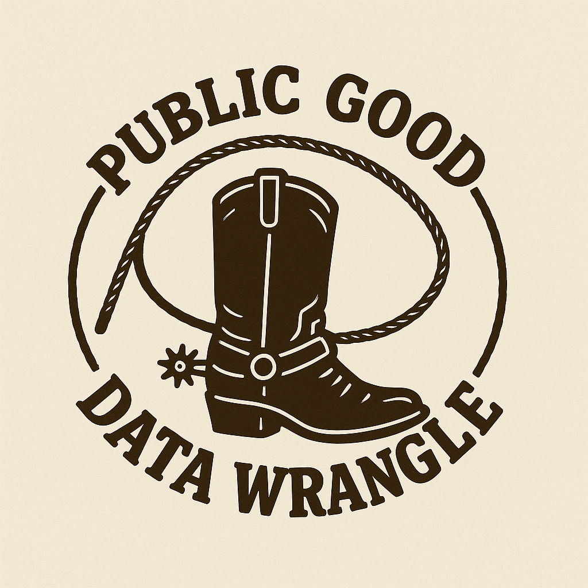

# Public Good Data Wrangle website

This repository hosts a Quarto website project for Davidson College's Public Good 
Data Wrangle (PGDW), a yearly "data hackathon" for Davidson students co-developed 
by the [Department of Data Science](https://www.davidson.edu/academic-departments/data-science) 
and the [Institute for Public Good](https://www.apublicgood.com/).

