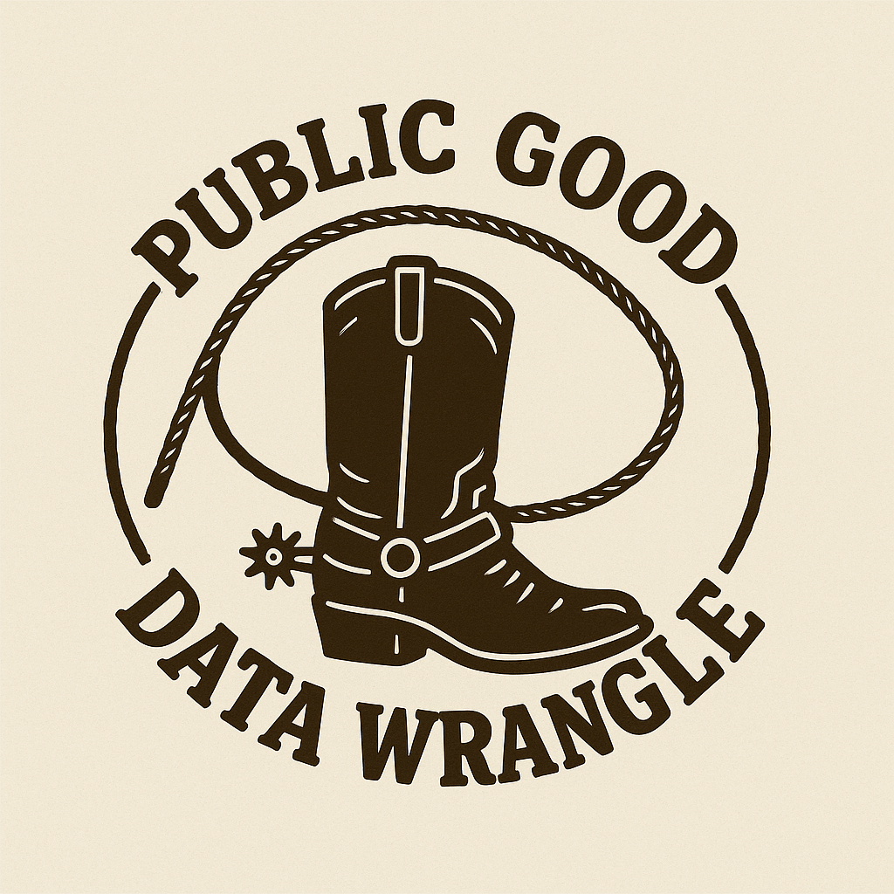

# Public Good Data Wrangle website

This repository hosts a Quarto website project for Davidson College's Public Good 
Data Wrangle (PGDW), a yearly "data hackathon" for Davidson students co-developed 
by the [Department of Data Science](https://www.davidson.edu/academic-departments/data-science) 
and the [Institute for Public Good](https://www.apublicgood.com/).

## Deployment

`.github/workflows/main.yaml` renders the site on every push to `main`, then publishes `docs/` into the `datawrangle/` subfolder of [`DavidsonCollege-DataScience/datasci-hub`](https://github.com/DavidsonCollege-DataScience/datasci-hub). That hub repo is the only one that deploys to the shared `datasci.davidson.edu` Azure Static Web App — see its README for why (Azure SWA deploys fully replace the app's content, so multiple repos deploying straight to it would clobber each other) and for the one-time secret setup (`HUB_REPO_PUSH_TOKEN`, a fine-grained PAT scoped to just that repo).